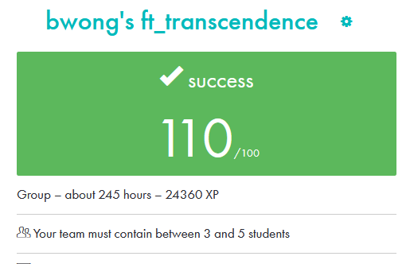

# 42-ft_transcendence

This project is centered around the design, development, and organization of a full-stack web application

## Requirement

• This project must be created in group of 3 - 5 people\
 Groupmate :
[krozis](https://github.com/krozis)
[alessiobenincasa](https://github.com/alessiobenincasa)
[42-lbastian](https://github.com/42-lbastian)

• Modules \
 1. Use a Framework as backend (Django) \
 2. Use a front-end framework or toolkit (bootstrap) \
 3. Use a database for the backend (PostgreSQL) \
 4. Standard user management, authentication, users across tournaments \
 5. Game Customization Options \
 6. Introduce an AI Opponent \
 7. User and Game Stats Dashboards\
 8. Implement Two-Factor Authentication (2FA) and JWT \
 9. Use of advanced 3D techniques (Three.js) \
 10. Expanding Browser Compatibility \
 11. Multiple language supports

## Preview

## Final Marks

>[!NOTE]
> Project is currently rebuilding with nest.js and mongoDB for a better online experience
